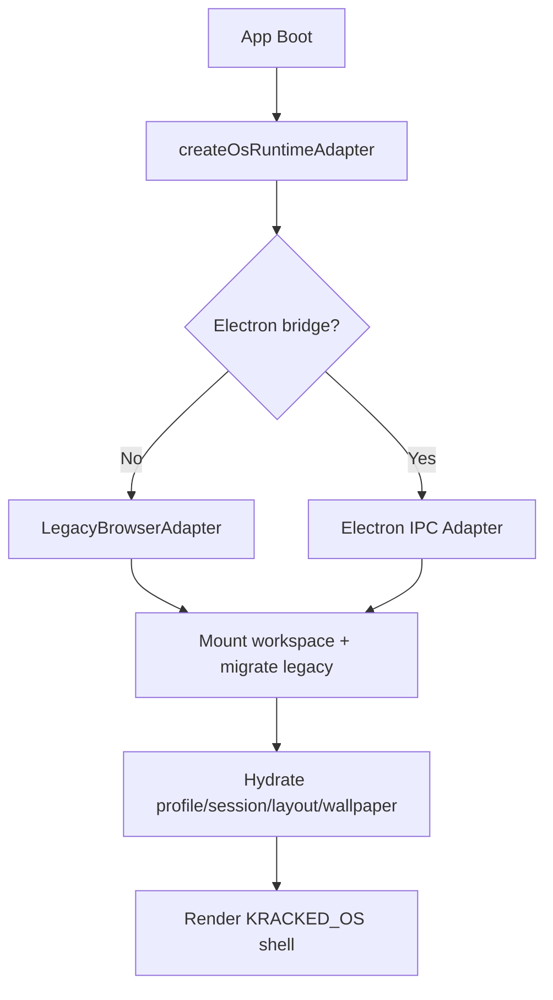

# KRACKED_OS Real-OS Runtime

## What is implemented

- `web-demo` runtime via IndexedDB-backed `LegacyBrowserAdapter`
- `desktop-local` runtime scaffold via Electron preload + IPC bridge
- provider-backed settings, wallpaper, explorer, and session hydration
- real workspace tree for Electron under:
  - Windows: `%USERPROFILE%\\KRACKED_OS`
  - macOS/Linux: `$HOME/KRACKED_OS`

## Workspace tree

```text
KRACKED_OS/
  system/
    mounts.json
    entry-metadata.json
  Users/
    default/
      Desktop/
      Documents/
      Wallpapers/
        BuiltIn/
        Imported/
      Settings/
        profile.json
        personalization.json
        desktop-layout.json
        session.json
      Trash/
      Community/
        resources.json
  mounts/
    kdacademy-lessons/
    prompt-assets/
```

## Current runtime split

- Browser:
  - `src/features/ijam-os/os-core/createLegacyBrowserAdapter.js`
  - Uses IndexedDB for workspace entries and JSON-backed settings.
- Electron:
  - `electron/main.js`
  - `electron/preload.js`
  - Uses real filesystem directories plus `system/entry-metadata.json`.

## Shell integration

- `src/App.jsx` boots `useOsRuntime()`
- `src/features/ijam-os/IjamOSWorkspace.jsx` now hydrates:
  - profile
  - session
  - personalization
  - desktop layout
  - explorer content
- active shared shell primitives now live in:
  - `src/features/ijam-os/components/WindowFrame.jsx`
  - `src/features/ijam-os/components/DesktopIcon.jsx`

## Explorer behavior

- File Explorer is now adapter-backed instead of lesson-only hardcoded data.
- Writable roots:
  - `Desktop`
  - `Documents`
  - `Wallpapers`
  - `Community`
  - `Trash`
- Read-only mounted roots:
  - `kdacademy-lessons`
  - `prompt-assets`

## Wallpaper behavior

- Built-in wallpapers still exist.
- Imported wallpapers are now stored through the runtime provider.
- Personalization stores:
  - `currentWallpaperId`
  - `fit`
  - `history`

## Electron scripts

```bash
npm run desktop
npm run desktop:dist
```

Optional dev-server launch:

```bash
$env:KRACKED_OS_DEV_SERVER_URL='http://127.0.0.1:5173'
npm run desktop
```

## Capability matrix

| Runtime | Real FS | Wallpaper Files | Containers |
| --- | --- | --- | --- |
| `web-demo` | No | Yes | No |
| `desktop-local` | Yes | Yes | Stub only |
| `desktop-isolated` | Planned | Planned | Research track |

## Container research status

- Linux: candidate for native LXC spike
- Windows: candidate for WSL2 or VM-backed adapter
- macOS: candidate for VM-backed adapter
- current Electron bridge exposes container IPC shape, but execution is intentionally stubbed until host strategy is selected

## Flow


